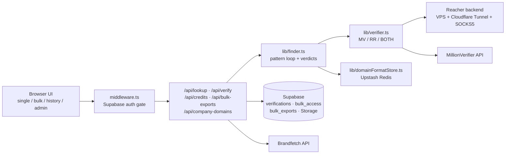

# Email Workbench

Internal email discovery and verification tool (Bamboo Reports / ResearchNXT). Given a person's name and company domain it finds their most likely work email; given a known address it checks whether the mailbox is real. No email is ever sent: verification is SMTP handshake probing (self-hosted Reacher) and/or the MillionVerifier API, the same approach commercial tools like Hunter.io document publicly.

## Features

- **Single discovery**: name + domain in, best email out, confidence-scored across 12 candidate patterns.
- **Single verification**: check an existing address; four verdicts (`valid`, `invalid`, `accept-all`, `not found`) with per-provider sub-results.
- **Bulk CSV/XLSX**: upload hundreds of rows, column auto-mapping, live progress/ETA, CSV export, auto-saved export history with signed downloads.
- **Dual-provider verification**: self-hosted Reacher (free per check) as primary, MillionVerifier (paid credits) as second opinion, in `MV` / `RR` / `BOTH` modes.
- **Cost controls**: 90-day org-wide result cache in Postgres, learned per-domain email format store in Upstash Redis, stop-on-first-valid pattern loop, RR-first credit policy. Cached results show "cached, no credit used".
- **On-demand MV re-check**: force a MillionVerifier check on any result (1 credit).
- **Company domain suggestions**: Brandfetch-powered autocomplete while typing a company name.
- **Auth, history, admin**: Supabase email/password auth (sign-up restricted to `@researchnxt.com`), per-user history under RLS, admin dashboard with org-wide stats, live MV credit balance, and per-user bulk access toggles.
- **Dark mode**, monospace-flavored UI.

## Architecture



Flow: the UI calls the API routes; `lib/finder.ts` generates candidates (`lib/patterns.ts`, learned format first), checks them through the configured provider(s), learns the winning format per domain, and records every attempt to Supabase. A 90-day cache over stored results answers repeats without spending provider calls. The app runs on Vercel serverless and cannot hold SMTP connections, so all SMTP probing is delegated to the Reacher container on a VPS.

## Tech stack

| Layer | Choice |
|---|---|
| Framework | Next.js 14.2.5 (App Router), React 18.3.1, TypeScript 5.5.3 |
| Auth / DB / Storage | Supabase (`@supabase/ssr`, `@supabase/supabase-js`), RLS |
| Cache | Upstash Redis (`@upstash/redis`) |
| Verification | Reacher (self-hosted, `reacherhq/backend`), MillionVerifier API |
| Suggestions | Brandfetch API |
| Spreadsheets | SheetJS (`xlsx`), lazy-loaded |
| Tooling | Turborepo, npm 10.7.0 |

## Getting started

```bash
npm install
cp .env.example .env.local     # fill in values below
# Fresh Supabase project: run supabase/schema.sql in the SQL editor.
# Existing database: run the files in supabase/migrations/ instead
# (schema.sql drops and recreates the verifications table).
npm run dev
```

`npm run typecheck` type-checks; `node lib/reacherMap.selfcheck.ts` runs the verdict-mapping self-check. For the Reacher backend, see [documentation/reacher-deployment.md](documentation/reacher-deployment.md).

## Environment variables

| Variable | Required | Description |
|---|---|---|
| `MILLIONVERIFIER_API_KEY` | Yes unless `VERIFICATION_METHOD=RR` | MillionVerifier API key |
| `MILLIONVERIFIER_BASE_URL` | No | Override the MV endpoint (default `https://api.millionverifier.com/api/v3`) |
| `VERIFICATION_METHOD` | No | `MV` (default), `RR` (Reacher only), or `BOTH` (Reacher primary + MV second opinion) |
| `REACHER_BACKEND_URL` | RR/BOTH modes | Self-hosted Reacher backend URL (Cloudflare Tunnel hostname) |
| `REACHER_SECRET` | No | Shared secret sent as `x-reacher-secret` |
| `BRANDFETCH_CLIENT_ID` | No | Enables company domain suggestions |
| `BRANDFETCH_API_KEY` | No | Declared in `.env.example`; not currently read by the code |
| `UPSTASH_REDIS_REST_URL` | No | Redis REST URL for org-wide learned-format storage |
| `UPSTASH_REDIS_REST_TOKEN` | No | Redis REST token |
| `NEXT_PUBLIC_SUPABASE_URL` | Yes | Supabase project URL |
| `NEXT_PUBLIC_SUPABASE_PUBLISHABLE_KEY` | Yes | Supabase anon/publishable key |
| `SUPABASE_SECRET_KEY` | Yes | Service-role key (server-only, bypasses RLS) |
| `ADMIN_EMAILS` | Yes | Comma-separated emails allowed to view `/admin` |
| `EMAIL_ENGINE_LOG` | No | `1` forces server logging on, `off` disables (default: on outside production) |

## Documentation Reference

| Document | Covers |
|---|---|
| [documentation/architecture.md](documentation/architecture.md) | System overview, request flow, directory responsibilities |
| [documentation/email-discovery-engine.md](documentation/email-discovery-engine.md) | Pattern generation, find loop, confidence scoring, domain format store |
| [documentation/verification.md](documentation/verification.md) | Reacher + MillionVerifier integration, verdict mapping, result caching, MV re-check |
| [documentation/database.md](documentation/database.md) | Every Supabase table, RLS, access control, admin roles, bulk access |
| [documentation/bulk-processing.md](documentation/bulk-processing.md) | Bulk flow, parallel cache sweep, exports and history |
| [documentation/reacher-deployment.md](documentation/reacher-deployment.md) | Self-hosted Reacher via docker-compose, tunnel and proxy config |
| [documentation/development.md](documentation/development.md) | Setup, full env var table, scripts, middleware/auth, testing |

A plain-language walkthrough of the engine (with a worked example and the Hunter.io comparison) lives in [flow.md](flow.md).
